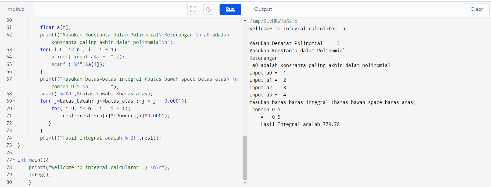

# Integral Calculaltor

&nbsp;

## Penulis:
### Yosep Putra Setiyanto
### 13320026

&nbsp;

&nbsp;

### Gambaran Umum

marupakan program yang dapat menghitung hasil integral dari suatu fungsi polinomial dengan batas bawah dan batas atas yang ditentukan pengguna.  
.
### Cara Kerja

kalkulator ini bekerja dengan konsep integral rieman dengan delta 0,1 sehingga mungkin tidak seakurat dengan menggunakan kalkulator integral yang seharusnya    
.   
### Cara Pemakaian

- siapkan fungsi polinoimal yang akan diintegralkan
- masukan derajat polinomial atau pangkat terbesar pada variabel
- masukan konstanta konstanta yang ada pada fungsi polinomial mulai dari konstanta yang paling belakang
- masukan batas bawah dan batas atas integral dengan format penulisan   
<"batas atas"><"spasi"><"batas bawah">
- maka hasil integral akan ditampilkan

### Screenshot Running Program

&nbsp;

