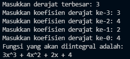
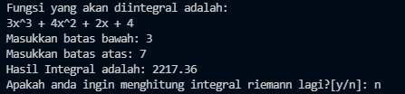
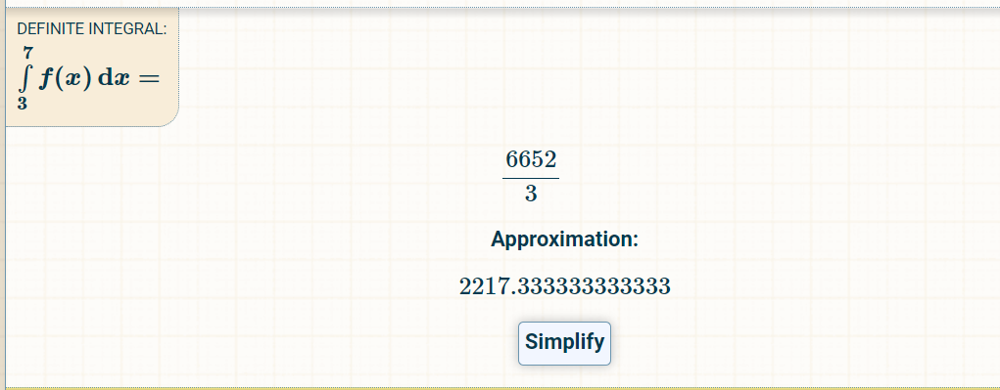

# Riemann Integral Calculator w/ C language 

Folder pada repository ini berisi sebuah makefile dan sebuah c file yang berisi implementasi kalkulator integral riemann. Folder ini dibuat dalam rangka memenuhi tugas SEKURO Programming yang kedua. 
<br>
Untuk melakukan compilation terhadap C program, buka terminal dan jalankan: 
```shell
make
```
Kemudian tulis: 
```shell
./a
```
Program akan berjalan apabila kompilasi berhasil. Saat program berhasil dikompilasi, maka program akan meminta derajat tertinggi dari fungsi yang akan diintegral. Diasumsi bahwa derajat bernilai integer dan >= 0. Selanjutnya user diminta untuk mengisi koefisien untuk masing-masing derajat. Contohnya adalah sebagai berikut: <br><br>
 <br><br>

Setelah fungsi berhasil dimasukkan, selanjutnya program akan meminta batas bawah dan batas atas integral. Setelah keduanya berhasil dimasukkan, maka program akan menampilkan hasil integral menggunakan metode Integral Riemann. User dapat mengisi ulang fungsi jika ingin melakukan integral lagi dengan mengetikkan ```y```, atau terminasi program dengan mengetikkan ```n```. Contohnya sebagai berikut: <br><br>

 <br><br>

Nilai n yang digunakan pada program ini adalah sebesar 100000. Hasil yang diperoleh untuk fungsi yang sama jika menggunakan kalkulator integral di internet adalah 2217.333:<br><br> 

 <br><br>

Tampak bahwa hasil antara keduanya kurang lebih sama. Adanya perbedaan dikarenakan terdapat pembulatan menjadi dua angka dibelakang koma pada program ini.

